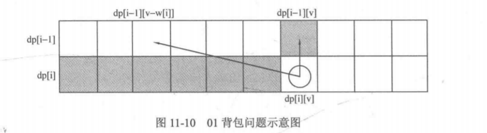
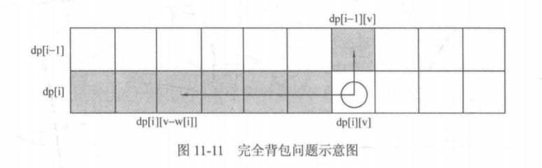

# [322. 零钱兑换](https://leetcode-cn.com/problems/coin-change/)

> 给定不同面额的硬币 coins 和一个总金额 amount。编写一个函数来计算可以凑成总金额所需的最少的硬币个数。如果没有任何一种硬币组合能组成总金额，返回 -1。
>
> 示例 1:
>
> 输入: coins = [1, 2, 5], amount = 11
> 输出: 3 
> 解释: 11 = 5 + 5 + 1
> 示例 2:
>
> 输入: coins = [2], amount = 3
> 输出: -1
>
>
> 说明:
> 你可以认为每种硬币的数量是无限的。
>

1. 完全背包问题。



```java
// 完全背包问题。
class Solution {
    public int coinChange(int[] coins, int amount) {
        // 因为是硬币的面值，所以假设coins的元素全是正整数。
        int n = coins.length;
        if (n == 0) return -1;
        if (amount <= 0) return 0;
        // (i, j)表示在coins[0, i]中选取若干个硬币，和为j。
        // dp[i][j]表示达到状态(i, j)**最少**需要多少硬币。
        int[][] dp = new int[n][amount+1];
        // 边界。
        // 注意(0, j)不是边界，(-1, j)才是。
        // 我们根据状态转移方程和dp数组的含义来设置边界的值。
        // 状态转移方程：dp[i][j]=Math.min(dp[i-1][j], dp[i][j-coins[i]]+1)。
        // for (int j=1; j<=amount; j++) {
        //     dp[0][j] = coins[0]==j? 1: Integer.MAX_VALUE/2;
        // }
        for (int j=1; j<=amount; j++) {
            // Integer.MAX_VALUE+1会溢出。
            dp[0][j] = Integer.MAX_VALUE/2;
        }
        for (int i=0; i<n; i++) {
            dp[i][0] = 0;
        }
        // 注意(0, j)不是边界，(-1, j)才是。
        // for (int i=1; i<n; i++) {
        for (int i=0; i<n; i++) {
            for (int j=1; j<=amount; j++) {
                // 选或不选coins[i]。
                if (i > 0)
                    dp[i][j] = dp[i-1][j];
                if (j >= coins[i] && dp[i][j-coins[i]]+1<dp[i][j]) {
                    dp[i][j] = 1+dp[i][j-coins[i]];
                }
            }
        }
        return dp[n-1][amount]==Integer.MAX_VALUE/2? -1: dp[n-1][amount];
    }
}
```

```java
// 使用滚动数组优化空间复杂度。
class Solution {
    public int coinChange(int[] coins, int amount) {
        // 因为是硬币的面值，所以假设coins的元素全是正整数。
        int n = coins.length;
        if (n == 0) return -1;
        if (amount <= 0) return 0;
        // (i, j)表示在coins[0, i]中选取若干个硬币，和为j。
        // dp[i][j]表示达到状态(i, j)**最少**需要多少硬币。
        int[] dp = new int[amount+1];
        // 边界。
        // 注意(0, j)不是边界，(-1, j)才是。
        Arrays.fill(dp, Integer.MAX_VALUE/2);
        // for (int j=1; j<=amount; j++) {
            // Integer.MAX_VALUE+1会溢出。
            // dp[j] = Integer.MAX_VALUE/2;
        // }
        dp[0] = 0;
        // 注意(0, j)不是边界，(-1, j)才是。
        // for (int i=1; i<n; i++) {
        for (int i=0; i<n; i++) {
            for (int j=coins[i]; j<=amount; j++) {
                // 选或不选coins[i]。
                dp[j] = Math.min(dp[j], dp[j-coins[i]]+1);
            }
        }
        return dp[amount]==Integer.MAX_VALUE/2? -1: dp[amount]; // 这里的dp[amount]是已滚动n次的dp[n-1][amount]。
    }
}
```

