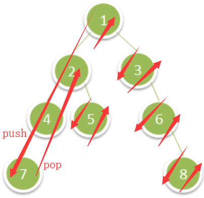

# 1305. All Elements in Two Binary Search Trees

> Given two binary search trees `root1` and `root2`.
>
> Return a list containing *all the integers* from *both trees* sorted in **ascending** order.
>
> **Example 1:**
>
> 
>
> ```
> Input: root1 = [2,1,4], root2 = [1,0,3]
> Output: [0,1,1,2,3,4]
> ```
>
> **Example 2:**
>
> ```
> Input: root1 = [0,-10,10], root2 = [5,1,7,0,2]
> Output: [-10,0,0,1,2,5,7,10]
> ```
>
> **Example 3:**
>
> ```
> Input: root1 = [], root2 = [5,1,7,0,2]
> Output: [0,1,2,5,7]
> ```
>
> **Example 4:**
>
> ```
> Input: root1 = [0,-10,10], root2 = []
> Output: [-10,0,10]
> ```
>
> **Example 5:**
>
> 
>
> ```
> Input: root1 = [1,null,8], root2 = [8,1]
> Output: [1,1,8,8]
> ```
>
> **Constraints:**
>
> - Each tree has at most `5000` nodes.
> - Each node's value is between `[-10^5, 10^5]`.

1. Medium。



```cpp
class Solution {
public:
    vector<int> getAllElements(TreeNode* root1, TreeNode* root2) {
        vector<int> v, v1, v2;
        // bst的中序序列是有序上升的。
        dfs(root1, v1);
        dfs(root2, v2);
        // 双指针合并两个有序数组。
        // 也可以用排序，这样整体时间复杂度就是O(NlogN)。
        auto n1=v1.size(), n2=v2.size();
        for (int i=0, j=0, a, b; i<n1 || j<n2; ) {
            a = i<n1? v1[i]: INT_MAX;
            b = j<n2? v2[j]: INT_MAX;
            if (a < b) {
                v.push_back(v1[i++]);
            } else {
                v.push_back(v2[j++]);
            }
        }
        return v;
    }
    
    void dfs(TreeNode* root, vector<int>& v) {
        if (!root) return;
        dfs(root->left, v);
        v.push_back(root->val);
        dfs(root->right, v);
    }
};
```

```cpp
// 迭代递归结合的中序遍历。
void pushLeft(stack<TreeNode*> &s, TreeNode* n) {
    while (n != nullptr) 
        s.push(exchange(n, n->left)); // `T exchange( T& obj, U&& new_value );`，返回obj的旧值。
}
vector<int> getAllElements(TreeNode* root1, TreeNode* root2) {
    vector<int> res;
    stack<TreeNode*> s1, s2;
    pushLeft(s1, root1);
    pushLeft(s2, root2);
    while (!s1.empty() || !s2.empty()) {
        stack<TreeNode*> &s = s1.empty() ? s2 : s2.empty() ? s1 : 
        s1.top()->val < s2.top()->val ? s1 : s2;
        auto n = s.top(); s.pop();
        res.push_back(n->val);
        pushLeft(s, n->right);
    }
    return res;
}
```

```cpp
// https://leetcode.com/problems/all-elements-in-two-binary-search-trees/discuss/464073/C%2B%2B-One-Pass-Traversal
// Generic Solution.
// Time: O(n log k), where n is the total number of nodes in all trees, and k is the number of trees.（最小堆的大小为k）
// Memory: O(n + k) for the stack and priority queue.
class BSTIterator {
  stack<TreeNode*> s;
  void pushLeft(TreeNode* n) {
    while (n != nullptr) s.push(exchange(n, n->left));
  }
public:
  BSTIterator(TreeNode* root) { pushLeft(root); }
  bool hasNext() const { return !s.empty(); }
  int next() {
    auto n = s.top(); s.pop();
    pushLeft(n->right);
    return n->val;
  }
};
class PeekingIterator : public BSTIterator {
  bool peeked = false;
  int last_val = 0;
public:
  PeekingIterator(TreeNode* root) : BSTIterator(root) { }
  int peek() {
    if (peeked) return last_val;
    peeked = true;
    return last_val = BSTIterator::next();
  }
  int next() {
    if (peeked) {
      peeked = false;
      return last_val;
    }
    return BSTIterator::next();
  }
  bool hasNext() const {
    return peeked || BSTIterator::hasNext();
  }
};
vector<int> mergeKTrees(vector<TreeNode*> trees) {
  vector<int> res;
  priority_queue <pair<int, PeekingIterator*>,
    vector<pair<int, PeekingIterator*>>, greater<pair<int, PeekingIterator*>> > q;
  for (auto t : trees) {
    auto it = new PeekingIterator(t);
    if (it->hasNext()) q.push({ it->peek(), it });
  }
  while (!q.empty()) {
    auto p = q.top(); q.pop();
    res.push_back(p.second->next());
    if (p.second->hasNext())
      q.push({ p.second->peek(), p.second });
  }
  return res;
}
vector<int> getAllElements(TreeNode* root1, TreeNode* root2) {
  return mergeKTrees({ root1, root2 });
}
```

