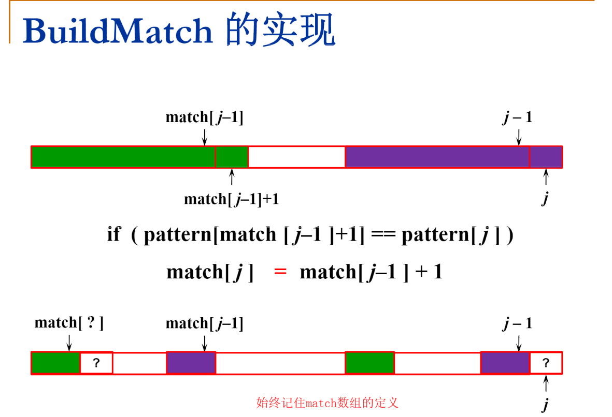

# 1367. Linked List in Binary Tree

> Given a binary tree `root` and a linked list with `head` as the first node. 
>
> Return True if all the elements in the linked list starting from the `head` correspond to some *downward path* connected in the binary tree otherwise return False.
>
> In this context downward path means a path that starts at some node and goes downwards.
>
> **Example 1:**
>
> ****
>
> ```
> Input: head = [4,2,8], root = [1,4,4,null,2,2,null,1,null,6,8,null,null,null,null,1,3]
> Output: true
> Explanation: Nodes in blue form a subpath in the binary Tree.  
> ```
>
> **Example 2:**
>
> ****
>
> ```
> Input: head = [1,4,2,6], root = [1,4,4,null,2,2,null,1,null,6,8,null,null,null,null,1,3]
> Output: true
> ```
>
> **Example 3:**
>
> ```
> Input: head = [1,4,2,6,8], root = [1,4,4,null,2,2,null,1,null,6,8,null,null,null,null,1,3]
> Output: false
> Explanation: There is no path in the binary tree that contains all the elements of the linked list from head.
> ```
>
> **Constraints:**
>
> - `1 <= node.val <= 100` for each node in the linked list and binary tree.
> - The given linked list will contain between `1` and `100` nodes.
> - The given binary tree will contain between `1` and `2500` nodes.

1. Medium。

2. [KMP算法讲解]([https://github.com/KshZh/ZJU-data-structure/blob/master/12%20%E7%BB%BC%E5%90%88%E4%B9%A0%E9%A2%98%E9%80%89%E8%AE%B2/KMP.pdf](https://github.com/KshZh/ZJU-data-structure/blob/master/12 综合习题选讲/KMP.pdf))

   

   
```cpp
// 根据hint的实现。
// 一开始仅仅把isSubPath()实现为dfs()，但这是不够的，因为dfs()的问题在于当找到一个与head匹配的起点后，会从这个起点往下匹配，如果匹配失败，就会直接返回到起点上面，不会从起点往下找别的起点。
// 直接使用dfs()会导致下面这样的测试样例无法通过：
// [1,10]
// [1,null,1,10,1,9]
class Solution {
public:
    bool isSubPath(ListNode* head, TreeNode* root) {
        if (!root) return false; // 空树，但链表还没完。
        if (dfs(head, root)) return true;
        return isSubPath(head, root->left) || isSubPath(head, root->right);
    }
    
    bool dfs(ListNode* head, TreeNode* root) {
        if (!root) return false; // 空树，但链表还没完。
        if (root->val == head->val) {
            if (!head->next) return true;
            int ret = false;
            if (root->left && root->left->val==head->next->val)
                // return isSubPath(head->next, root->left); // 这里还不能返回，因为左子树失败了，可能右子树可以。
                ret = dfs(head->next, root->left);
            if (root->right && root->right->val==head->next->val)
                ret = ret || dfs(head->next, root->right);
            return ret;
        }
        return dfs(head, root->left) || dfs(head, root->right);
    }
};
```

```cpp
// Time O(N * min(L,H))
// Space O(H)
// where N = tree size, H = tree height, L = list length.
bool isSubPath(ListNode* head, TreeNode* root) {
    if (!head) return true;
    if (!root) return false;
    return dfs(head, root) || isSubPath(head, root->left) || isSubPath(head, root->right);
}

// 不在caller处判断，而在callee中判断，代码简化不少。
bool dfs(ListNode* head, TreeNode* root) {
    if (!head) return true;
    if (!root) return false;
    return head->val == root->val && (dfs(head->next, root->left) || dfs(head->next, root->right));
}
```

```cpp
// KMP算法。
class Solution {
public:
    bool isSubPath(ListNode* head, TreeNode* root) {
        if (!root) return false;
        vector<ListNode*> map; // 将链表映射为数组，方便处理。就像字符串查找中的字符数组。
        for (ListNode* p=head; p; p=p->next)
            map.push_back(p);
        vector<int> match = buildMatch(head, map); // 建立match数组。
        return dfs(0, root, match, map);
    }
    
    vector<int> buildMatch(ListNode* head, const vector<ListNode*>& map) {
        vector<int> match{-1};
        head = head->next;
        for (int i=1, j; head; i++, head=head->next) {
            j = match[i-1];
            while (j>=0 && map[j+1]->val!=head->val) // 要判断j>=0，否则虽然j+1必然>=0，但j可能为-1，则match[j]可能越界。
                j = match[j];
            if (map[j+1]->val == head->val) {
                match.push_back(j+1);
            } else {
                match.push_back(-1);
            }
        }
        return match;
    }
    
    // 使用KMP算法，出现不匹配时，root不需要回头，只管“往前走”，i才可能回头。
    bool dfs(int i, TreeNode* root, const vector<int>& match, const vector<ListNode*>& map) {
        if (i == map.size()) return true;
        if (!root) return false;
        if (i>0 && root->val!=map[i]->val) 
            i = match[i-1]+1;
        i += root->val==map[i]->val;
        return dfs(i, root->left, match, map) || dfs(i, root->right, match, map);
    }
};
```

