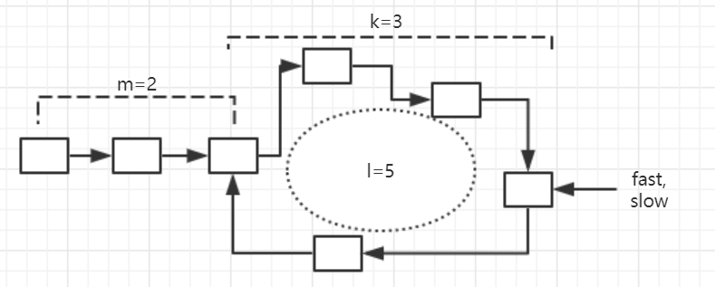

# 142. Linked List Cycle II

> Given a linked list, return the node where the cycle begins. If there is no cycle, return `null`.
>
> **Note:** Do not modify the linked list.

1. 用哈希表还是很容易解决的。

2. Floyd龟兔算法检测环。指针fast走了`dis_f = m + n_f*l + k`，指针slow走了`dis_s = m + n_s*l + k`，由于fast每次走两步，slow每次走一步，所以`dis_f = 2*dis_s`，代入化简，得`m+k = l*(n_f-2*n_s) = l*n`，即`m = l*n - k = l*(n-1) + (l-k)`，因为在一个圈中某一点A走整数倍个圈数，还是回到点A，也就是在圈中走整数倍个圈数，对位置的变动没有贡献。所以让一个指针从表头开始走，另一个指针从fast和slow相遇的结点开始走，它们每次都走一步，最终，当第二个指针走了`l-k`步后，第一个指针也走了m步，此时两个指针都到达了环的起点。下图刚好是`n=1`的情况，当然n也可以大于1。

   检测有无环，慢指针需要走`m+n_s*l+k`步，快指针需要走`m+n_f*l+k`，由于`dis_f=2*dis_s`，所以总共走了`3*dis_s=3*m+3*n_s*l+3*k`步。从检测出环到确定环的起点，需要额外走`m`步，两个指针就是`2*m`步。
   
   

```cpp
class Solution {
public:
    ListNode *detectCycle(ListNode *head) {
        unordered_set<ListNode*> book;
        while (head) {
            if (book.find(head) != book.end()) return head;
            book.insert(head);
            head = head->next;
        }
        return nullptr;
    }
};
```

```cpp
class Solution {
public:
    ListNode *detectCycle(ListNode *head) {
        ListNode *p=head, *q=head;
        do {
            if (!q || !q->next) return nullptr; // 快指针到达了终点，说明没有环。
            p = p->next;
            q = q->next->next;
        } while (p != q); // 快慢指针相遇，说明有环。
        p = head;
        while (p != q) {
            p = p->next;
            q = q->next;
        }
        return p;
    }
};
```

