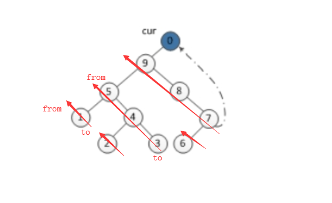

# 145. Binary Tree Postorder Traversal

> Given a binary tree, return the *postorder* traversal of its nodes' values.
>
> **Example:**
>
> ```
> Input: [1,null,2,3]
>    1
>     \
>      2
>     /
>    3
> 
> Output: [3,2,1]
> ```
>
> **Follow up:** Recursive solution is trivial, could you do it iteratively?

1. Hard，Morris算法。
2. 

```cpp
class Solution {
public:
    vector<int> postorderTraversal(TreeNode* root) {
        vector<int> ans;
        TreeNode dummy(-1);
        dummy.left = root;
        TreeNode* curr = &dummy;
        TreeNode* prev;
        while (curr) {
            if (!curr->left) {
                curr = curr->right;
                continue;
            }
            // 找到curr在中序序列中的前驱结点，即左子树的最右下的结点。
            prev = curr->left;
            while (prev->right && prev->right!=curr)
                prev = prev->right;
            if (prev->right == nullptr) { // 左子树还没遍历过，遍历左子树。
                prev->right = curr;
                curr = curr->left;
            } else { // `prev->right == curr`，左子树刚遍历完回到curr/根。
                reverseTraversal(curr->left, prev, ans); // 和先序/中序遍历类似，只不过这里改成逆序访问"左子树"（叙述不太准确，看图）
                prev->right = nullptr;
                curr = curr->right;
            }
        }
        return ans;
    }
    
    // 用了递归，所以还是O(N)空间复杂度。
    void reverseTraversal(TreeNode* from, TreeNode* to, vector<int>& ans) {
        if (from != to)
            reverseTraversal(from->right, to, ans);
        ans.push_back(from->val);
    }
};
```

```cpp
// 不用递归，只对树进行整形。
class Solution {
public:
    vector<int> postorderTraversal(TreeNode* root) {
        vector<int> ans;
        TreeNode dummy(-1);
        dummy.left = root;
        TreeNode* curr = &dummy;
        TreeNode* prev;
        while (curr) {
            if (!curr->left) {
                curr = curr->right;
                continue;
            }
            // 找到curr在先/中序序列中的前驱结点。
            prev = curr->left;
            while (prev->right && prev->right!=curr)
                prev = prev->right;
            if (prev->right == nullptr) {
                prev->right = curr;
                curr = curr->left;
            } else { // `prev->right == curr`，刚遍历完prev，回到curr。
                reverseTraversal(curr->left, prev, ans);
                // prev->right = nullptr; // 第二次reverse()的时候已经设置了。
                curr = curr->right;
            }
        }
        return ans;
    }
    
    void reverse(TreeNode* from, TreeNode* to) {
        TreeNode *x=from, *y=from->right, *z;
        while (x != to) { // 如果只有一个结点，即`from==to`，则不会进入循环，避免了空指针异常。
            z = y->right;
            y->right = x;
            x = y;
            y = z;
        }
        from->right = nullptr; // 这一句记得写，要把所有右指针都反过来。
    }
    
    void reverseTraversal(TreeNode* from, TreeNode* to, vector<int>& ans) {
        reverse(from, to);
        TreeNode* p = to;
        while (p) {
            ans.push_back(p->val);
            p = p->right;
        }
        reverse(to, from);
    }
};
```

```cpp
// 后序遍历的迭代版。
vector<int> postorderTraversal(TreeNode* root) {
    vector<int> ans;
    // prev指向一棵树的后序遍历中的最后一个结点，也就是这棵树的根。
    TreeNode* prev{};
    TreeNode* p = root;
    stack<TreeNode*> s;
    while (p || !s.empty()) {
        while (p) {
            s.push(p);
            p = p->left;
        }
        p = s.top();
        if (p->right && p->right!=prev) {
            // p是一棵树，其右子树存在且还没被遍历，那么应该先遍历其右子树。
            p = p->right;
        } else {
            // p是一棵树，其右子树为空，那么在后序遍历中，就轮到遍历p，
            // 或者其右子树已经遍历过了，那么也轮到遍历p。
            ans.push_back(p->val);
            prev = p;
            s.pop(); // p已经遍历过了，弹出。
            p = nullptr;
        }
    }
    return ans;
}
```

```cpp
// 比较直观的迭代版实现。
vector<int> postorderTraversal(TreeNode* root) {
    if (!root) return {};
    vector<int> ans;
    // first是结点的地址，
    // second是下次应该访问该结点的哪一棵子树。
    stack<pair<TreeNode*, int>> s;
    s.push({root, 0});
    while (!s.empty()) {
        auto& p = s.top();
        if (p.second == 2) {
            // 该结点的子树都遍历过了，根据后序遍历的规则，
            // 现在轮到遍历该结点了。
            ans.push_back(p.first->val);
            s.pop();
        } else {
            if (p.second==0 && p.first->left)
                s.push({p.first->left, 0});
            else if (p.second==1 && p.first->right)
                s.push({p.first->right, 0});
            p.second++;
        }
    }
    return ans;
}
```

