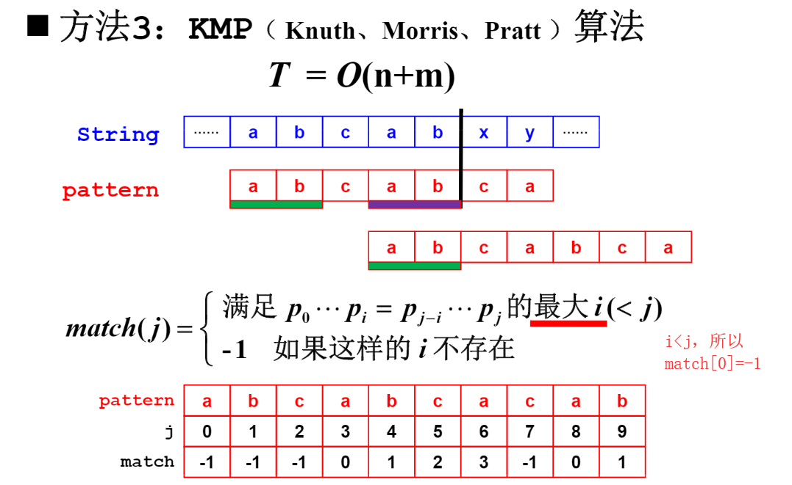
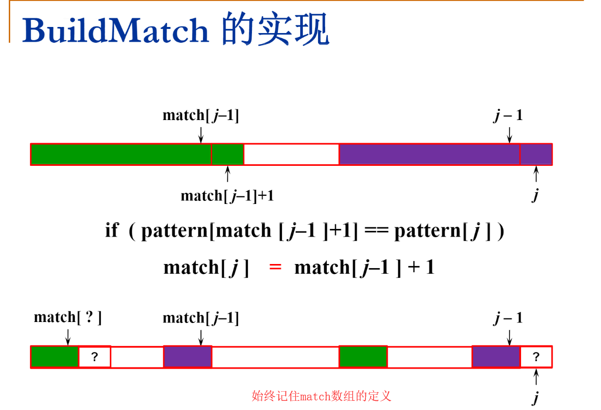

# 28. Implement strStr()

> Implement [strStr()](http://www.cplusplus.com/reference/cstring/strstr/).
>
> Return the index of the first occurrence of needle in haystack, or **-1** if needle is not part of haystack.
>
> **Example 1:**
>
> ```
> Input: haystack = "hello", needle = "ll"
> Output: 2
> ```
>
> **Example 2:**
>
> ```
> Input: haystack = "aaaaa", needle = "bba"
> Output: -1
> ```
>
> **Clarification:**
>
> What should we return when `needle` is an empty string? This is a great question to ask during an interview.
>
> For the purpose of this problem, we will return 0 when `needle` is an empty string. This is consistent to C's [strstr()](http://www.cplusplus.com/reference/cstring/strstr/) and Java's [indexOf()](https://docs.oracle.com/javase/7/docs/api/java/lang/String.html#indexOf(java.lang.String)).

1. Easy。

2. [KMP算法讲解]([https://github.com/KshZh/ZJU-data-structure/blob/master/12%20%E7%BB%BC%E5%90%88%E4%B9%A0%E9%A2%98%E9%80%89%E8%AE%B2/KMP.pdf](https://github.com/KshZh/ZJU-data-structure/blob/master/12 综合习题选讲/KMP.pdf))

   

   

```java
// 暴力破解。
class Solution {
    public int strStr(String haystack, String needle) {
        for (int i = 0; ; i++) {
            for (int j = 0; ; j++) {
                if (j == needle.length()) return i;
                if (i + j == haystack.length()) return -1;
                if (needle.charAt(j) != haystack.charAt(i + j)) break;
            }
        }
    }
}
```

```cpp
// KMP算法，只回退needle，haystack总是向前走。
class Solution {
public:
    int strStr(string haystack, string needle) {
        if (haystack.size() < needle.size()) return -1;
        vector<int> match = buildMatch(needle);
        int i, j;
        auto m=haystack.size(), n=needle.size();
        for (i=j=0; i<m && j<n; ) {
            if (haystack[i] == needle[j])
                i++, j++;
            else if (j>0)
                j = match[j-1]+1; // 回退j，i保持不变。j-1和needle[j-1]指向的元素是相等的，所以要加一与haystack[i]比较。
            else // j==0.
                i++;
        }
        if (j == n)
            return i-n; // 右开减区间长度等于左闭。
        return -1;
    }
    
    vector<int> buildMatch(const string& needle) {
        vector<int> match(needle.size(), -1);
        for (int i=1; i<needle.size(); i++) {
            int j = match[i-1];
            while (j>=0 && needle[j+1] != needle[i]) // 要判断j>=0，否则虽然j+1必然>=0，但j可能为-1，则match[j]可能越界。
                j = match[j];
            if (needle[j+1] == needle[i])
                match[i] = j+1;
            else
                match[i] = -1;
        }
        return match;
    }
};
```

