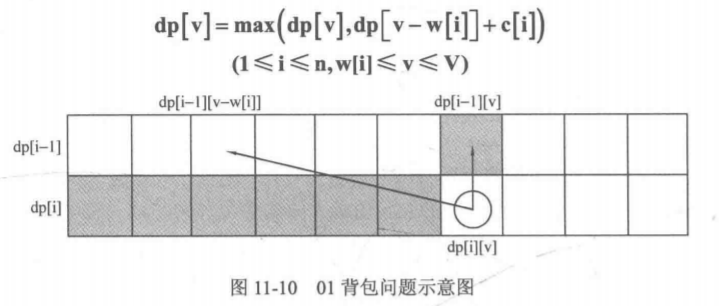

# 322. Coin Change

> You are given coins of different denominations and a total amount of money *amount*. Write a function to compute the fewest number of coins that you need to make up that amount. If that amount of money cannot be made up by any combination of the coins, return `-1`.
>
> **Example 1:**
>
> ```
> Input: coins = [1, 2, 5], amount = 11
> Output: 3 
> Explanation: 11 = 5 + 5 + 1
> ```
>
> **Example 2:**
>
> ```
> Input: coins = [2], amount = 3
> Output: -1
> ```
>
> **Note**:
> You may assume that you have an infinite number of each kind of coin.

1. Medium，完全背包问题/最优化问题。




```cpp
// 从问题出发的dp/记忆化搜索。
class Solution {
    unordered_map<int, int> count;
public:
    int coinChange(vector<int>& coins, int amount) {
        if (amount < 0) return -1; // amount减到负数，说明这不是一条有效的路径，返回-1来表示。
        if (amount == 0) return 0; // 这是一条有效的路径，这个边界条件下没用到任何硬币，返回0。
        if (count.find(amount) != count.end()) return count[amount];
        int min_ = INT_MAX, n;
        for (int coin: coins) {
            n = coinChange(coins, amount-coin);
            if (n!=-1 && n<min_)
                min_ = n+1;
        }
        count[amount] = min_==INT_MAX? -1: min_;
        return count[amount];
    }
};
```

```cpp
// 要从宏观角度看dp的含义和程序设计。
class Solution {
public:
    int coinChange(vector<int>& coins, int amount) {
        // 完全背包问题，每个物品有重量和价值，
        // dp[i][j]表示在前i个物品中挑选若干个物品，使得承重为j的背包价值最大。
        // 只不过典型的背包问题是背包的承重减去物品的重量（单位相同），这里是amount减去硬币的面值（单位相同），然后根据问题，每个硬币的value都是1。dp[i][j]表示在前i个硬币中挑选若干个硬币，使得将数额j消耗为0的硬币数最少，如果在前i个硬币中无法挑选出使得数额j消耗为0的硬币组合，则dp[i][j]为INT_MAX。
        // 这里可以使用滚动数组，避免使用二维数组，节省内存。
        auto n = coins.size();
        auto& weights = coins;
        int i, j;
        vector<int> dp(amount+1, INT_MAX-1); // 避免下面的循环中加一报溢出错误。
        dp[0] = 0; // 边界是`dp[i][0]=0`。
        for (int i=0; i<n; i++) { // 枚举每个硬币。
            for (int j=weights[i]; j<=amount; j++) {
                dp[j] = min(dp[j-weights[i]]+1, dp[j]);
            }
        }
        return dp[amount]==INT_MAX-1? -1: dp[amount];
    }
};
```

