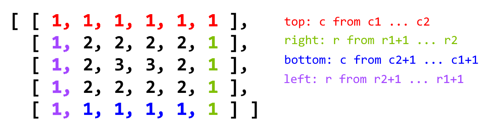

# 54. Spiral Matrix

> Given a matrix of *m* x *n* elements (*m* rows, *n* columns), return all elements of the matrix in spiral order.
>
> **Example 1:**
>
> ```
> Input:
> [
>  [ 1, 2, 3 ],
>  [ 4, 5, 6 ],
>  [ 7, 8, 9 ]
> ]
> Output: [1,2,3,6,9,8,7,4,5]
> ```

1. Medium，格式化。
2. 

```cpp
class Solution {
public:
    vector<int> spiralOrder(vector<vector<int>>& matrix) {
        // 涉及到多行的格式化输出，在内存中保留一个缓冲区，
        // 设置该缓冲区后再输出。
        if (matrix.size() == 0)
            return {};
        auto m=matrix.size(), n=matrix[0].size();
        vector<int> res;
        int r1=0, r2=m-1, c1=0, c2=n-1;
        while (r1<=r2 && c1<=c2) {
            for (int c=c1; c<=c2; c++) res.push_back(matrix[r1][c]);
            for (int r=r1+1; r<=r2; r++) res.push_back(matrix[r][c2]);
            if (r1<r2 && c1<c2) { // 若是“一维”的情况(r1==r2 || c1==c2)，则不需要绕圈。
                // 注意不要写成`c>0`了。
                for (int c=c2-1; c>c1; c--) res.push_back(matrix[r2][c]);
                for (int r=r2; r>r1; r--) res.push_back(matrix[r][c1]);
            }
            r1++, r2--, c1++, c2--;
        }
        return res;
    }
};
```

