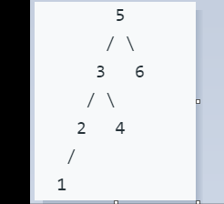

# 54. 二叉搜索树的第k大节点

> 给定一棵二叉搜索树，请找出其中第k大的节点。

1. Easy。



```java
// bst: left < root < right。
// 所以按照左中右遍历，得到一个升序序列，按照右中左遍历，得到一个降序序列。
// 这道题就用右中左遍历。
class Solution {
    private int n, res;

    public int kthLargest(TreeNode root, int k) {
        n = k;
        dfs(root);
        return res;
    }

    private void dfs(TreeNode root) {
        // 在callee中做检查，caller尽管调用。
        // 注意第二个条件，如果已经遍历过k个结点了，就不再继续递归调用了，剪枝。
        if (root==null || n<=0) return;
        dfs(root.right);
        if (--n == 0) res = root.val;
        dfs(root.left);
    }
}
```

```java
// 迭代版。
class Solution {
    public int kthLargest(TreeNode root, int k) {
        Stack<TreeNode> s = new Stack<>();
        while (!s.empty() || root!=null) {
            // 遍历右子树。（时刻记住栈的特点，后进先出，后进先处理）
            // 走到右最底下。
            while (root != null) {
                s.push(root);
                root = root.right;
            }
            // 返回。
            root = s.pop();
            if (--k == 0) {
                return root.val;
            }
            // 遍历左子树。
            root = root.left;
        }
        return -1;
    }
}
```

