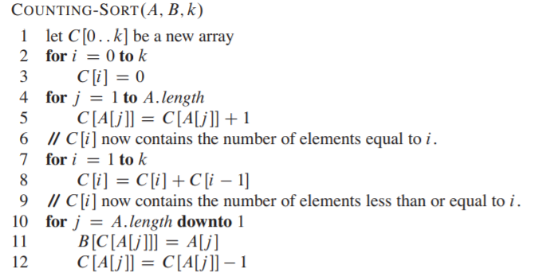
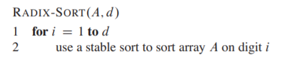
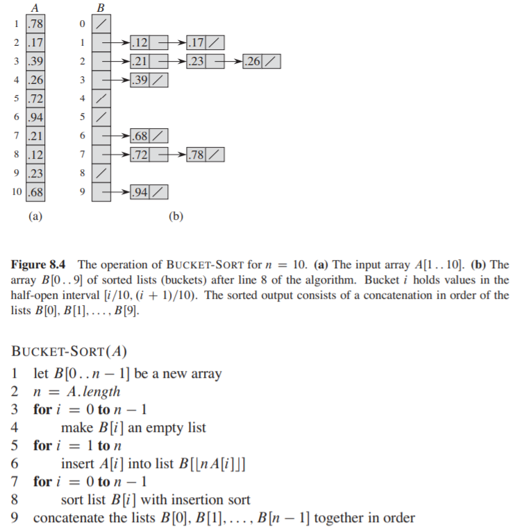

# [912. Sort an Array](https://leetcode.com/problems/sort-an-array/)

> Given an array of integers `nums`, sort the array in ascending order.
>
>  
>
> **Example 1:**
>
> ```
> Input: nums = [5,2,3,1]
> Output: [1,2,3,5]
> ```
>
> **Example 2:**
>
> ```
> Input: nums = [5,1,1,2,0,0]
> Output: [0,0,1,1,2,5]
> ```
>
>  
>
> **Constraints:**
>
> - `1 <= nums.length <= 50000`
> - `-50000 <= nums[i] <= 50000`

```java
class Solution {
    public int[] sortArray(int[] nums) {
        bubbleSort(nums);
        return nums;
    }
    
    // 冒泡排序，最好O(N)，最差O(N^2)。
    private void bubbleSort(int[] nums) {
        boolean flag;
        int n = nums.length;
        // n-1趟。
        for (int i=0; i<n-1; i++) {
            flag = false;
            // 一趟冒泡。
            for (int j=0; j<n-1; j++) {
                if (nums[j]>nums[j+1]) {
                    swap(j, j+1);
                    flag = true;
                }
            }
            if (!flag) {
                // 全程无交换，已经有序。
                return;
            }
        }
    }
    
    private void swap(int[] nums, int i, int j) {
        int temp = nums[j];
        nums[j] = nums[i];
        nums[i] = temp;
    }
}
```

```java
// 插入排序，最好O(N)，即基本有序，最坏O(N^2)。
private void insertionSort(int[] nums) {
    int n=nums.length, x, i, j;
    // 初始的排序部分只有一个元素，即nums[0]。
    // 遍历未排序部分，每次把未排序部分的首元素插入到已排序部分中的恰当位置处。
    for (i=1; i<n; i++) {
        x = nums[i];
        for (j=i; j>0 && nums[j-1]>x; j--) {
            nums[j] = nums[j-1];
        }
        nums[j] = x;
    }
}
```

```java
private void shellSort(int[] nums) {
    int n=nums.length, x, j;
    // 希尔增量序列。
    for (int D=n/2; D>=1; D--) {
        // 在nums[0, 0+D, 0+2D, ..., 0+nD]这个序列中执行插入排序。
        // 第一个元素nums[0]是有序的。
        for (int i=D; i<n; i+=D) {
            x = nums[i];
            for (j=i; j-D>=0 && nums[j-D]>x; j-=D) {
                nums[j] = nums[j-D];
            }
            nums[j] = x;
        }
    }
}
```

```java
// 选择排序，最好O(N)，即基本有序，最坏O(N^2)。
private void selectionSort(int[] nums) {
    int n=nums.length, min, i, j;
    // 遍历每个slot，在后面选取一个最小元放入当前slot中。
    for (i=0; i<n-1; i++) {
        min = i;
        for (j=i+1; j<n; j++) {
            if (nums[j] < nums[min]) {
                min = j;
            }
        }
        if (min != i) {
            swap(nums, i, min);
        }
    }
}
```

```java
// 堆排序，相比选择排序，使用堆O(logN)选出最大元，而不是遍历O(N)。
private void heapSort(int[] nums) {
    int n=nums.length, min, pos, i, j;
    // 先建一个最大堆。
    // 堆表现为完全二叉树，用数组存储，下标从0开始，
    // 对于元素i，其左子结点在i*2+1，右子结点在i*2+2，父结点在(i-1)/2。
    for (i=(n-1-1)/2; i>=0; i--) {
        down(nums, i, n);
    }
    for (i=n-1; i>0; i--) {
        swap(nums, 0, i);
        down(nums, 0, i); // 注意堆的大小在改变。
    }
}

private void down(int[] nums, int i, int n) {
    int x = nums[i];
    for (int j=i*2+1; j<n; i=j, j=j*2+1) { // 注意循环变量更新时，两个指针都要向下移动。
        if (j+1<n && nums[j+1]>nums[j]) { // 选择孩子中最大的那个。
            j++;
        }
        if (x < nums[j]) {
            nums[i] = nums[j];
        } else {
            break;
        }
    }
    nums[i] = x;
}
```

```java
class Solution {
    int[] temp;
    
    public int[] sortArray(int[] nums) {
        temp = new int[nums.length];
        mergeSort(nums, 0, nums.length);
        return nums;
    }
    
    // 归并排序，[l, r)。
    private void mergeSort(int[] nums, int l, int r) {
        if (l+1 == r) {
            // 只有一个元素，有序。
            return;
        }
        int mid = l+(r-l)/2;
        mergeSort(nums, l, mid);
        mergeSort(nums, mid, r);
        
        merge(nums, l, mid, r);
    }
    
    // 合并两个有序子序列。
    private void merge(int[] nums, int l, int mid, int r) {
        int i, j, k;
        // 注意不要把k初始化为0了。
        for (k=i=l, j=mid; i<mid && j<r; ) {
            if (nums[i] < nums[j]) {
                temp[k++] = nums[i++];
            } else {
                temp[k++] = nums[j++];
            }
        }
        while (i < mid) {
            temp[k++] = nums[i++];
        }
        while (j < r) {
            temp[k++] = nums[j++];
        }
        // 把排序好的搬到原数组中。
        for (i=l; i<r; i++) {
            nums[i] = temp[i];
        }
    }
}
```

```java
class Solution {
    int[] temp;
    public int[] sortArray(int[] nums) {
        temp = new int[nums.length];
        mergeSort(nums);
        return nums;
    }
    
    // 归并排序，迭代版。
    private void mergeSort(int[] nums) {
        // i为有序子序列的长度，初始为1，因为单个元素是有序的。
        // 每次合并，新的有序子序列的长度为旧的有序子序列的两倍。
        for (int i=1; i<nums.length; i*=2) {
            mergePass(nums, i);
        }
    }
    
    private void mergePass(int[] nums, int len) {
        int i;
        for (i=0; i+len+len<=nums.length; i+=2*len) {
            merge(nums, i, i+len, i+len+len);
        }
        // 剩下一个半，需要再合并一下。
        if (i+len < nums.length) {
            merge(nums, i, i+len, nums.length);
        }
    }
}
```

```java
// 快速排序，[l, r)。
private void quickSort(int[] nums, int l, int r) {
    if (l+1 >= r) {
        return;
    }
    int pivot = partition(nums, l, r);
    // 注意，pivot已经在正确的位置上了，不需要进一步排序。
    // 所以递归排序的区间不要包含pivot。
    quickSort(nums, l, pivot);
    quickSort(nums, pivot+1, r);
}

private int partition(int[] nums, int l, int r) {
    // 双指针分割数组。
    // 选取nums[r-1]作为主元，小于主元的在主元左边，大于主元的在主元右边。
    int pivot=nums[r-1], i, j;
    // i指向存放大于pivot的元素的slot，j遍历数组，遇到小于主元的元素就把它交换到slot上。
    for (i=l, j=l; j<r-1; j++) {
        if (nums[j] < pivot) {
            if (i == j) {
                i++;
            } else {
                swap(nums, i++, j);   
            }
        }
    }
    swap(nums, i, r-1); // 将主元放到中间。
    return i;
}
```



计数排序的思想是确定输入数组中，小于等于元素x的元素个数k，那么元素x就应该放在位置k-1处。

计数排序只有在输入数组的元素范围较小时才有比较好的性能。

这里每放置一个元素，就要对应的`C[A[j]]--`，避免多个相等的元素放在了同一个位置。

不过计数排序对含有负数的输入并不适用，用哈希表是不行的，可以用平衡搜索树？



基数排序的一个点在于，从最低位开始排，那么排到某一位时，如果两个数在这一位上的数字相等，那么它们之间的顺序由低位的大小决定，而这个顺序已经在之前的排序过程中确定下来了。所以每一趟对每一位的排序，都需要用一个稳定的排序算法来排，这很重要。



类似计数排序对输入的假设，桶排序假设输入数组的元素是均匀分布的(uniform distribution)。

# [148. Sort List](https://leetcode.com/problems/sort-list/)

> Sort a linked list in *O*(*n* log *n*) time using constant space complexity.
>
> **Example 1:**
>
> ```
> Input: 4->2->1->3
> Output: 1->2->3->4
> ```
>
> **Example 2:**
>
> ```
> Input: -1->5->3->4->0
> Output: -1->0->3->4->5
> ```

```java
// O(NlogN)的排序算法常见的就是堆排序、归并排序、快速排序，其中堆排序需要线性空间，对于这道题来说，如果输入存放在数组中的话，可以直接在把数组调整为堆，不用额外空间。
// 如果把递归消耗的栈空间算进来的话，其实归并排序也不是常数空间复杂度。
// 快速排序并不好实现，要把链表分为大于小于pivot两个链表，之后还要合并两个链表以及pivot结点。
class Solution {
    public ListNode sortList(ListNode head) {
        if (head==null || head.next==null) {
            // 没有元素或者只有一个元素，有序。
            return head;
        }
        // 快慢指针走链表，走完慢指针指向链表中间结点，对于偶数结点，则指向中间缝隙左边的结点。
        ListNode p=head, q=head.next;
        while (q!=null && q.next!=null) {
            p = p.next;
            q = q.next.next;
        }
        q = p.next;
        p.next = null;
        return merge(sortList(head), sortList(q));
    }
    
    // 合并两个有序链表。
    private ListNode merge(ListNode head1, ListNode head2) {
        ListNode dummy = new ListNode();
        ListNode p = dummy;
        while (head1!=null && head2!=null) {
            if (head1.val < head2.val) {
                p.next = head1;
                head1 = head1.next;
            } else {
                p.next = head2;
                head2 = head2.next;
            }
            p = p.next; // 别忘了移动p。
        }
        if (head1 != null) {
            p.next = head1;
        } else if (head2 != null) {
            p.next = head2;
        }
        return dummy.next;
    }
}
```

# 147. Insertion Sort List

> Sort a linked list using insertion sort.
>
> 
>
> 
> A graphical example of insertion sort. The partial sorted list (black) initially contains only the first element in the list.
> With each iteration one element (red) is removed from the input data and inserted in-place into the sorted list
>  
>
> 
>
> **Algorithm of Insertion Sort:**
>
> 1. Insertion sort iterates, consuming one input element each repetition, and growing a sorted output list.
> 2. At each iteration, insertion sort removes one element from the input data, finds the location it belongs within the sorted list, and inserts it there.
> 3. It repeats until no input elements remain.
>
> 
> **Example 1:**
>
> ```
> Input: 4->2->1->3
> Output: 1->2->3->4
> ```
>
> **Example 2:**
>
> ```
> Input: -1->5->3->4->0
> Output: -1->0->3->4->5
> ```

```java
class Solution {
    public ListNode insertionSortList(ListNode head) {
        if (head==null || head.next==null) {
            return head;
        }
        // 涉及单链表的插入删除，最好使用一个dummy结点简化代码。
        ListNode sorted=new ListNode(), p, temp;
        while (head != null) {
            // 将结点head插入已排序部分的恰当位置。
            for (p=sorted; p.next!=null && p.next.val<head.val; p=p.next) {}
            temp = head.next;
            head.next = p.next;
            p.next = head;
            head = temp;
        }
        return sorted.next;
    }
}
```

```java
// 一个优化，仅当prev.next.val大于head.val，即插入位置不在prev后面时，才从头开始寻找插入位置。
class Solution {
    public ListNode insertionSortList(ListNode head) {
        if (head==null || head.next==null) {
            return head;
        }
        // 涉及单链表的插入删除，最好使用一个dummy结点简化代码。
        ListNode sorted=new ListNode(Integer.MAX_VALUE), p=sorted, temp;
        while (head != null) {
            // 将结点head插入已排序部分的恰当位置。
            if (p.val > head.val) {
                p=sorted;
            }
            
            for (; p.next!=null && p.next.val<head.val; p=p.next) {}
            temp = head.next;
            head.next = p.next;
            p.next = head;
            head = temp;
        }
        return sorted.next;
    }
}
```

# [面试题51. 数组中的逆序对](https://leetcode-cn.com/problems/shu-zu-zhong-de-ni-xu-dui-lcof/)

> 在数组中的两个数字，如果前面一个数字大于后面的数字，则这两个数字组成一个逆序对。输入一个数组，求出这个数组中的逆序对的总数。
>
>  
>
> 示例 1:
>
> ```
> 输入: [7,5,6,4]
> 输出: 5
> ```
>
>
> 限制：
>
> 0 <= 数组长度 <= 50000
>

```java
// 在排序过程中计算逆序对/交换了多少次。
// 使用归并排序，时间复杂度为O(NlogN)，空间复杂度为O(N)。
class Solution {
    int[] temp;

    public int reversePairs(int[] nums) {
        temp = new int[nums.length];
        return reversePairs(nums, 0, nums.length);
    }

    // [l, r)
    private int reversePairs(int[] nums, int l, int r) {
        if (l+1 >= r) {
            return 0;
        }

        int mid = l+(r-l)/2;
        int left = reversePairs(nums, l, mid); // 注意这里不能用`reversePairs(nums, l, mid+1)`，因为mid+1可能等于r，那么问题规模就没有缩小，就会导致无限递归。
        int right = reversePairs(nums, mid, r);
        if (nums[mid-1] < nums[mid]) {
            // 整个序列是上升的，不需要合并。
            return left+right;
        }
        return left+right+merge(nums, l, mid, r);
    }

    private int merge(int[] nums, int l, int mid, int r) {
        for (int i=l; i<r; i++) {
            temp[i] = nums[i];
        }
        int cnt = 0;
        for (int i=l, j=mid, k=l; i<mid || j<r; k++) {
            if (i == mid) {
                // 前半部分排完了，剩后半部分。
                nums[k] = temp[j++];
            } else if (j == r) {
                // 后半部分排完了，剩前半部分。
                nums[k] = temp[i++];
                // temp[i]本应该排在后半部分之后，但原本却排在后半部分之前，这里就有len(后半部分)个逆序对。
                cnt += r-mid;
            } else if (temp[i] <= temp[j]) {
                nums[k] = temp[i++];
                // temp[i]本应该排在[mid+1, j-1]之后，但原本却排在[mid+1, j-1]之前，这里就有len([mid+1, j-1])个逆序对。
                cnt += j-mid;
            } else {
                nums[k] = temp[j++];
            }
        }
        return cnt;
    }
}
```

```java
// TODO：树状数组思路。
```

