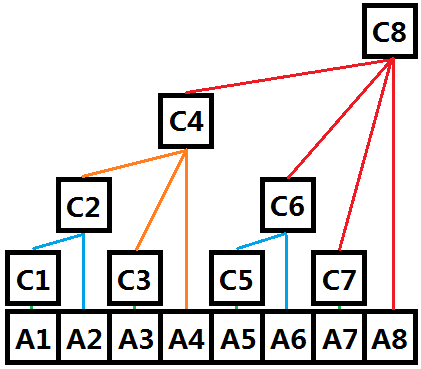

树状数组参考这篇文章：http://www.cppblog.com/menjitianya/archive/2015/11/02/212171.html

这里总结一下树状数组的要点：

- 树状数组，存储上是数组，逻辑上是一棵树；
- 树状数组解决的基本问题是**单点更新，区间求和**，两者的时间复杂度均为O(logN)；
- 树的每个结点c[i]存储以a[i]为终点的长度为lowbit(i)的子序列的和。`lowbit(i)=i&-i`，-i首先对i每一位取反，包括符号位，再加1，所以lowbit(i)=2^k，k为i低位第一个1左边零的个数，若i最低位就为1，那么lowbit(i)=2^0=1。因此，奇数的i对应的c[i]就是树的叶子结点，存储以a[i]为终点长度为1的子序列的和；
- 若`i+lowbit(i)=j`，则定义c[j]为c[i]的父结点，即若结点c[i]管理长度为lowbit(i)的区间和，则其父结点c[j]管理长度为2*lowbit(i)的区间和。比如c[4]管理长度为4的区间和，则其父结点c[8]管理长度为8的区间和，包含子结点管理的区间。



# [307. 区域和检索 - 数组可修改](https://leetcode-cn.com/problems/range-sum-query-mutable/)

> 给定一个整数数组  nums，求出数组从索引 i 到 j  (i ≤ j) 范围内元素的总和，包含 i,  j 两点。
>
> update(i, val) 函数可以通过将下标为 i 的数值更新为 val，从而对数列进行修改。
>
> 示例:
>
> ```
> Given nums = [1, 3, 5]
> 
> sumRange(0, 2) -> 9
> update(1, 2)
> sumRange(0, 2) -> 8
> ```
>
> **说明:**
>
> 1. 数组仅可以在 *update* 函数下进行修改。
> 2. 你可以假设 *update* 函数与 *sumRange* 函数的调用次数是均匀分布的。

```java
// 朴素的实现是区间求和O(N)，单点更新O(1)。
// 这里用树状数组实现。
class NumArray {
    int[] c, nums;

    public NumArray(int[] nums) {
        c = new int[nums.length+1]; // 下标从1开始比较方便编程。
        this.nums = nums; // 这里只是做题，实际上应该拷贝一份更安全。
        for (int i=0, j; i<nums.length; i++) {
            c[i+1] += nums[i];
            j = i+1+lowbit(i+1);
            if (j < nums.length+1) {
                c[j] += c[i+1]; // 把该结点管理的区间和加到父结点上，因为父结点也管理了子结点的区间和。
            }
        }
    }
    
    public void update(int i, int val) {
        add(i+1, val-nums[i]);
        nums[i] = val; // 别忘了更新原数组，不然下一次的参考值就过时了。
    }
    
    public int sumRange(int i, int j) {
        return sum(j+1)-sum(i);
    }

    // [0, i]区间求和。
    private int sum(int i) {
        // 输入的i从1开始。
        int res = 0;
        for (; i>=1; i-=lowbit(i)) {
            res += c[i];
        } 
        return res;
    }

    // 单点更新。
    private void add(int i, int val) {
        // 输入的i从1开始。
        for (; i<c.length; i+=lowbit(i)) {
            c[i] += val;
        }
    }

    private int lowbit(int i) {
        return i&-i;
    }
}

/**
 * Your NumArray object will be instantiated and called as such:
 * NumArray obj = new NumArray(nums);
 * obj.update(i,val);
 * int param_2 = obj.sumRange(i,j);
 */
```

```java
// TODO 用线段树实现
```

