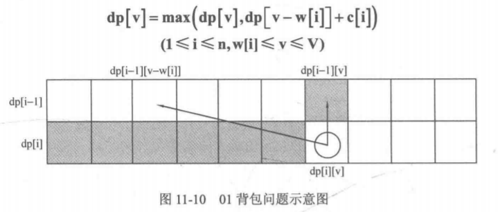
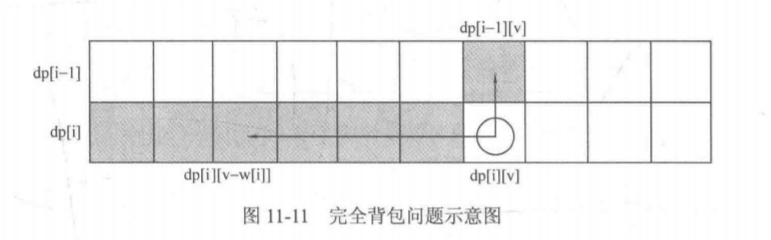

# [322. Coin Change](https://leetcode.com/problems/coin-change/)

> You are given coins of different denominations and a total amount of money *amount*. Write a function to compute the fewest number of coins that you need to make up that amount. If that amount of money cannot be made up by any combination of the coins, return `-1`.
>
> **Example 1:**
>
> ```
> Input: coins = [1, 2, 5], amount = 11
> Output: 3 
> Explanation: 11 = 5 + 5 + 1
> ```
>
> **Example 2:**
>
> ```
> Input: coins = [2], amount = 3
> Output: -1
> ```
>
> **Note**:
> You may assume that you have an infinite number of each kind of coin.

```java
class Solution {
    public int coinChange(int[] coins, int amount) {
        int n=coins.length, max=amount+1;
        // 完全背包问题。
        // dp[i][j]表示从[0, i]中拿若干个硬币（使用最少的硬币），面值和为j。
        int[] dp = new int[amount+1];
        // 边界，是第一行的上一行，即没有任何硬币可以使用。
        Arrays.fill(dp, max); // 没有硬币可使用，无法组成面值i。注意不要使用Integer.MAX_VALUE，后面加一就会溢出。
        dp[0] = 0; // 面值和能够减为0才是一条合法的路径/一组合法的组合。
        for (int i=0; i<n; i++) {
            for (int j=coins[i]; j<=amount; j++) {
                dp[j] = Math.min(dp[j], dp[j-coins[i]]+1);
            }
        }
        return dp[amount]==max? -1: dp[amount];
    }
}
```

```java
// 从问题出发的dp/记忆化搜索。
class Solution {
    unordered_map<int, int> count;
public:
    int coinChange(vector<int>& coins, int amount) {
        if (amount < 0) return -1; // amount减到负数，说明这不是一条有效的路径，返回-1来表示。
        if (amount == 0) return 0; // 这是一条有效的路径，这个边界条件下没用到任何硬币，返回0。
        if (count.find(amount) != count.end()) return count[amount];
        int min_ = INT_MAX, n;
        for (int coin: coins) {
            n = coinChange(coins, amount-coin);
            if (n!=-1 && n<min_)
                min_ = n+1;
        }
        count[amount] = min_==INT_MAX? -1: min_;
        return count[amount];
    }
};
```

# [518. Coin Change 2](https://leetcode.com/problems/coin-change-2/)

> You are given coins of different denominations and a total amount of money. Write a function to compute the number of combinations that make up that amount. You may assume that you have infinite number of each kind of coin.
>
> 
>
> **Example 1:**
>
> ```
> Input: amount = 5, coins = [1, 2, 5]
> Output: 4
> Explanation: there are four ways to make up the amount:
> 5=5
> 5=2+2+1
> 5=2+1+1+1
> 5=1+1+1+1+1
> ```
>
> **Example 2:**
>
> ```
> Input: amount = 3, coins = [2]
> Output: 0
> Explanation: the amount of 3 cannot be made up just with coins of 2.
> ```
>
> **Example 3:**
>
> ```
> Input: amount = 10, coins = [10] 
> Output: 1
> ```
>
>  
>
> **Note:**
>
> You can assume that
>
> - 0 <= amount <= 5000
> - 1 <= coin <= 5000
> - the number of coins is less than 500
> - the answer is guaranteed to fit into signed 32-bit integer

```java
class Solution {
    public int change(int amount, int[] coins) {
        // dp[i][j]表示在前i个硬币中选若干个，组成面值j的组合数。
        int[] dp = new int[amount+1];
        dp[0] = 1; // dp[-1][0]=1;
        for (int i=0; i<coins.length; i++) {
            for (int j=coins[i]; j<=amount; j++) {
                // dp[i][j] = dp[i-1][j] + dp[i][j-coins[i]];
                dp[j] += dp[j-coins[i]];
            }
        }
        return dp[amount];
    }
}
```

```cpp
// 从问题出发/记忆化搜索，比较慢。
class Solution {
    unordered_map<int, unordered_map<int, int>> book;
public:
    int change(int amount, vector<int>& coins) {
        return dfs(amount, 0, coins);
    }
    
    int dfs(int amount, int i, vector<int>& coins) {
        if (amount == 0) return 1;
        if (amount<0 || i>=coins.size()) return 0; // 将amount兑换到负值，说明这不是一条有效的路径。
        if (book.find(amount)!=book.end() && book[amount].find(i)!=book[amount].end()) return book[amount][i];
        int cnt = 0;
        // 完全背包问题，前面选过的不能选，元素i可以重复选。
        for (int j=i; j<coins.size(); j++) {
            cnt += dfs(amount-coins[j], j, coins);
        }
        book[amount][i] = cnt;
        return cnt;
    }
};
```

# [377. Combination Sum IV](https://leetcode.com/problems/combination-sum-iv/)

> Given an integer array with all positive numbers and no duplicates, find the number of possible combinations that add up to a positive integer target.
>
> **Example:**
>
> ```
> nums = [1, 2, 3]
> target = 4
> 
> The possible combination ways are:
> (1, 1, 1, 1)
> (1, 1, 2)
> (1, 2, 1)
> (1, 3)
> (2, 1, 1)
> (2, 2)
> (3, 1)
> 
> Note that different sequences are counted as different combinations.
> 
> Therefore the output is 7.
> ```
>
>  
>
> **Follow up:**
> What if negative numbers are allowed in the given array?
> How does it change the problem?
> What limitation we need to add to the question to allow negative numbers?
>
> **Credits:**
> Special thanks to [@pbrother](https://leetcode.com/pbrother/) for adding this problem and creating all test cases.

```java
// 与上一题不同，这是一个排列问题。
class Solution {
    public int combinationSum4(int[] nums, int target) {
        int[] dp = new int[target+1];
        dp[0] = 1;
        // 按列计算。
        // dp[i][j] = dp[i][j] + dp[i][j-nums[i]]，其中dp[i][j-nums[i]]是最后一行的那个，而不是同一行的。
        for (int i=0; i<=target; i++) {
            for (int j=0; j<nums.length; j++) {
                if (i >= nums[j]) {
                    // [1, 2, 3]
                    // dp[4]=dp[4-1]+dp[4-2]+dp[4-3]。
                    dp[i] += dp[i-nums[j]];
                }
            }
        }
        return dp[target];
    }
}
```

> Follow up:
>
> If ALL numbers are negative, then the solution would be the same if you switch signs for numbers and target simultaneously. However, there is no guaranteed finite solution if positive and negative numbers are mixed, e.g. nuts=[1,-1, 2] target = 0（因为是完全背包问题，可以选任意个1, -1，所以有无限个解法）

> Thank you. Some comment about the iterative solution with different orders of loops:
>
> order-1:
>
> ```
> for each sum in dp[]
>     for each num in nums[]
>         if (sum >= num)
>             dp[sum] += dp[sum-num];
> ```
>
> order-2:
>
> ```
> for each num in nums[]
>     for each sum in dp[]  >= num
>         dp[sum] += dp[sum-num];
> ```
>
> order-1 is used to calculate the number of combinations considering different sequences
>
> order-2 is used to calculate the number of combinations NOT considering different sequences
>
> Give an example nums[] = {1, 2, 3}, target = 4
>
> order-1 considers the number of combinations starting from 1, 2, and 3, respectively, so all sequences are considered as the graph below.
>
> 1 --> 1 --> 1 --> 1 --> (0)
> 1 --> 1 --> 2 --> (0)
> 1 --> 2 --> 1 --> (0)
> 1 --> 3 --> (0)
>
> 2 --> 1 --> 1 --> (0)
> 2 --> 2 --> (0)
>
> 3 --> 1 --> (0)
>
> order-2 considers the number of combinations starting from 0 (i.e., not picking anyone), and **the index of the num picked next must be >= the index of previous picked num**（关键）, so different sequences are not considered, as the graph below.
>
> (0) --> 1 --> 1 --> 1 --> 1
> (0) --> 1 --> 1 --> 2
> (0) --> 1 --> 3
> (0) --> 2 --> 2

```java
// 记忆化搜索。
class Solution {
    unordered_map<int, int> book;
public:
    int combinationSum4(vector<int>& nums, int target) {
        return dfs(nums, target);
    }
    
    int dfs(vector<int>& nums, int target) {
        if (target < 0) return 0;
        if (target == 0) return 1;
        if (book.find(target) != book.end()) return book[target];
        int cnt = 0;
        // 每一个元素都有无限个，
        // 每一个位置，都有nums.size()个选择。
        for (int num: nums) {
            cnt += dfs(nums, target-num);
        }
        book[target] = cnt;
        return cnt;
    }
};
```

# [416. Partition Equal Subset Sum](https://leetcode.com/problems/partition-equal-subset-sum/)

> Given a **non-empty** array containing **only positive integers**, find if the array can be partitioned into two subsets such that the sum of elements in both subsets is equal.
>
> **Note:**
>
> 1. Each of the array element will not exceed 100.
> 2. The array size will not exceed 200.
>
>  
>
> **Example 1:**
>
> ```
> Input: [1, 5, 11, 5]
> 
> Output: true
> 
> Explanation: The array can be partitioned as [1, 5, 5] and [11].
> ```
>
>  
>
> **Example 2:**
>
> ```
> Input: [1, 2, 3, 5]
> 
> Output: false
> 
> Explanation: The array cannot be partitioned into equal sum subsets.
> ```

```java
class Solution {
    public boolean canPartition(int[] nums) {
        int sum = 0;
        for (int i=0; i<nums.length; i++) {
            sum += nums[i];
        }
        if (sum%2 != 0) {
            return false;
        }
        // 转换为01背包问题。
        int target = sum/2;
        // dp[i][j]表示在[0, i]中取若干个数，是否存在一种组合，和为j。
        boolean[] dp = new boolean[target+1];
        dp[0] = true;
        // 按行计算。
        for (int i=0; i<nums.length; i++) {
            for (int j=target; j>=nums[i]; j--) { // 注意逆着来，
                dp[j] ||= dp[j-nums[i]]; // 如果dp[j-nums[i]]为true，那么dp[j]也为true（只要它选择减去nums[i]）。
            }
        }
        return dp[target];
    }
}
```

# [494. Target Sum](https://leetcode.com/problems/target-sum/)

> You are given a list of non-negative integers, a1, a2, ..., an, and a target, S. Now you have 2 symbols `+` and `-`. For each integer, you should choose one from `+` and `-` as its new symbol.
>
> Find out how many ways to assign symbols to make sum of integers equal to target S.
>
> **Example 1:**
>
> ```
> Input: nums is [1, 1, 1, 1, 1], S is 3. 
> Output: 5
> Explanation: 
> 
> -1+1+1+1+1 = 3
> +1-1+1+1+1 = 3
> +1+1-1+1+1 = 3
> +1+1+1-1+1 = 3
> +1+1+1+1-1 = 3
> 
> There are 5 ways to assign symbols to make the sum of nums be target 3.
> ```
>
> 
>
> **Note:**
>
> 1. The length of the given array is positive and will not exceed 20.
> 2. The sum of elements in the given array will not exceed 1000.
> 3. Your output answer is guaranteed to be fitted in a 32-bit integer.

```java
class Solution {
    public int findTargetSumWays(int[] nums, int S) {
        int sum = 0;
        for (int i=0; i<nums.length; i++) {
            sum += nums[i];
        }
        if (S>sum || -S>sum) {
            return 0; // 剪枝，否则会超出内存限制。
        }
        // 假设所有元素和为sum，所有添加正号的元素的和为A，所有添加负号的元素和为B，则有sum = A + B 且 S = A - B，解方程得A = (sum + S)/2。即题目转换成：从数组中选取一些元素使和恰好为(sum + S) / 2。可见这是一个恰好装满的01背包问题，要求所有方案数。
        if ((sum+S)%2 != 0) {
            return 0;
        }
        int target = (sum+S)/2;
        int[] dp = new int[target+1];
        dp[0] = 1;
        for (int i=0; i<nums.length; i++) {
            for (int j=target; j>=nums[i]; j--) {
                dp[j] += dp[j-nums[i]];
            }
        }
        return dp[target];
    }
}
```

```java
public class Solution {
    int count = 0;
    public int findTargetSumWays(int[] nums, int S) {
        int[][] memo = new int[nums.length][2001];
        for (int[] row: memo)
            Arrays.fill(row, Integer.MIN_VALUE);
        return calculate(nums, 0, 0, S, memo);
    }
    public int calculate(int[] nums, int i, int sum, int S, int[][] memo) {
        if (i == nums.length) {
            if (sum == S)
                return 1;
            else
                return 0;
        } else {
            // 数组没有负下标，所以要偏移一下。
            if (memo[i][sum + 1000] != Integer.MIN_VALUE) {
                return memo[i][sum + 1000];
            }
            int add = calculate(nums, i + 1, sum + nums[i], S, memo); // 取正。
            int subtract = calculate(nums, i + 1, sum - nums[i], S, memo); // 取负。
            memo[i][sum + 1000] = add + subtract;
            return memo[i][sum + 1000];
        }
    }
}
```

```java
public class Solution {
    public int findTargetSumWays(int[] nums, int S) {
        int[][] dp = new int[nums.length][2001];
        dp[0][nums[0] + 1000] = 1;
        dp[0][-nums[0] + 1000] += 1;
        for (int i = 1; i < nums.length; i++) {
            for (int sum = -1000; sum <= 1000; sum++) {
                if (dp[i - 1][sum + 1000] > 0) {
                    dp[i][sum + nums[i] + 1000] += dp[i - 1][sum + 1000];
                    dp[i][sum - nums[i] + 1000] += dp[i - 1][sum + 1000];
                }
            }
        }
        return S > 1000 ? 0 : dp[nums.length - 1][S + 1000];
    }
}
```

# [474. Ones and Zeroes](https://leetcode.com/problems/ones-and-zeroes/)

> Given an array, `strs`, with strings consisting of only `0s` and `1s`. Also two integers `m` and `n`.
>
> Now your task is to find the maximum number of strings that you can form with given **m** `0s` and **n** `1s`. Each `0` and `1` can be used at most **once**.
>
>  
>
> **Example 1:**
>
> ```
> Input: strs = ["10","0001","111001","1","0"], m = 5, n = 3
> Output: 4
> Explanation: This are totally 4 strings can be formed by the using of 5 0s and 3 1s, which are "10","0001","1","0".
> ```
>
> **Example 2:**
>
> ```
> Input: strs = ["10","0","1"], m = 1, n = 1
> Output: 2
> Explanation: You could form "10", but then you'd have nothing left. Better form "0" and "1".
> ```
>
>  
>
> **Constraints:**
>
> - `1 <= strs.length <= 600`
> - `1 <= strs[i].length <= 100`
> - `strs[i]` consists only of digits '0' and '1'.
> - `1 <= m, n <= 100`

```java
// 我们把每个字符串看做是一件物品，把字符串中0的数目和1的数目看做是两种“重量”，所以就变成了一个二维01背包问题，书包的两个限重分别是 m 和 n，要求书包能装下的物品的最大数目。
class Solution {
    public int findMaxForm(String[] strs, int m, int n) {
        int[][] dp = new int[m+1][n+1];
        int w1, w2;
        // 遍历行。
        for (int i=0; i<strs.length; i++) {
            // 计算第i-1个字符串的两个重量。
            w1 = w2 = 0;
            for (int j=0; j<strs[i].length(); j++) {
                if (strs[i].charAt(j) == '0') {
                    w1++;
                } else {
                    w2++;
                }
            }
            
            // 01背包, 逆向迭代更新dp。
            for (int j=m; j>=w1; j--) {
                for (int k=n; k>=w2; k--) {
                    dp[j][k] = Math.max(dp[j][k], 1+dp[j-w1][k-w2]);
                }
            }
        }
        return dp[m][n];
    }
}
```

# [石头碰撞](https://www.nowcoder.com/questionTerminal/9dd19c9305704138bdf83e2dffdcb4f4?answerType=1&f=discussion)

> 给定一组石头，每个石头有一个正数的重量。每一轮开始的时候，选择两个石头一起碰撞，假定两个石头的重量为x，y，x<=y,碰撞结果为
>  \1. 如果x==y，碰撞结果为两个石头消失
>  \2. 如果x != y，碰撞结果两个石头消失，生成一个新的石头，新石头重量为y-x
>
>  最终最多剩下一个石头为结束。求解最小的剩余石头质量的可能性是多少。
>
> 
>
> ##### **输入描述:**
>
> ```
> 第一行输入石头个数(<=100)
> 
> 第二行输入石头质量，以空格分割，石头质量总和<=10000
> ```
>
> 
>
> ##### **输出描述:**
>
> ```
> 最终的石头质量
> ```
>
> 示例1
>
> ## 输入
>
> ```
> 6
> 2 7 4 1 8 1
> ```
>
> ## 输出
>
> ```
> 1
> ```

```java
// 链接：https://www.nowcoder.com/questionTerminal/9dd19c9305704138bdf83e2dffdcb4f4?f=discussion
// 来源：牛客网
// 简单说下思路，利用0-1背包方法求出能将石头合并成2堆的情况，dp[j]代表是否能将石头分成其中一堆为j，另一堆为(sum-j)，其中一堆的最小值肯定不超过总和的一半，最后最接近的两堆的差即为最小值
import java.util.*;
public class Main{
    public static void main(String[] args){
        Scanner scanner=new Scanner(System.in);
        int n=scanner.nextInt(),sum=0,result=0;
        int[] nums=new int[n+1];
        for(int i=1;i<=n;i++) {
            nums[i]=scanner.nextInt();
            sum+=nums[i];
        }
        // dp[i][j]表示在[0, i]中挑若干个石头，是否能组成和j。
        boolean[] dp=new boolean[sum/2+1];
        dp[0]=true;
        for(int i=1;i<=n;i++)
            for(int j=sum/2;j>=nums[i];j--)
                dp[j]|=dp[j-nums[i]];
             
        for(int j=sum/2;j>=0;j--)
            if(dp[j]) {
               result=Math.abs(j-(sum-j));
               break;
            }
        System.out.println(result);
    }
}
```

# [找零](https://www.nowcoder.com/questionTerminal/944e5ca0ea88471fbfa73061ebe95728?answerType=1&f=discussion)

> Z国的货币系统包含面值1元、4元、16元、64元共计4种硬币，以及面值1024元的纸币。现在小Y使用1024元的纸币购买了一件价值为N(0<N≤1024)N (0 < N \le 1024)N(0<N≤1024)的商品，请问最少他会收到多少硬币？
>
> ##### **输入描述:**
>
> ```
> 一行，包含一个数N。
> ```
>
> ##### **输出描述:**
>
> ```
> 一行，包含一个数，表示最少收到的硬币数。
> ```
>
> 示例1
>
> ## 输入
>
> ```
> 200
> ```
>
> ## 输出
>
> ```
> 17
> ```
>
> ## 说明
>
> ```
> 花200，需要找零824块，找12个64元硬币，3个16元硬币，2个4元硬币即可。
> ```
>
> 
>
> ##### **备注:**
>
> ```
> 对于100%的数据，N(0<N≤1024)N (0 < N \le 1024)N(0<N≤1024)。
> ```

```java
import java.util.*;

public class Main {
    public static void main(String[] args) {
        // 完全背包问题。
        Scanner scanner = new Scanner(System.in);
        int target = 1024-scanner.nextInt();
        int[] coins = new int[]{1, 4, 16, 64};
        // dp[i][j]表示在[0, i]中选若干个硬币，面值和为target所需的最少硬币数。
        int[] dp = new int[target+1];
        Arrays.fill(dp, Integer.MAX_VALUE);
        dp[0] = 0;
        for (int i=0; i<4; i++) {
            for (int j=coins[i]; j<=target; j++) {
                // XXX 用或不用，可以先确定状态转移方程，再确定边界（即第一行的上一行）。
                dp[j] = Math.min(dp[j], dp[j-coins[i]]+1);
            }
        }
        System.out.println(dp[target]);
    }
}
```

```cpp
#include <iostream>
using namespace std;
int main()
{
    // 贪心。
    int num;
    while(cin>>num)
    {
        int cash=1024-num;
        int num_64=cash/64;
        int num_16=cash%64/16;
        int num_4=cash%64%16/4;
        int num_1=cash%64%16%4;
        cout<<num_64+num_16+num_4+num_1<<endl;
    }
    return 0;
}
```

